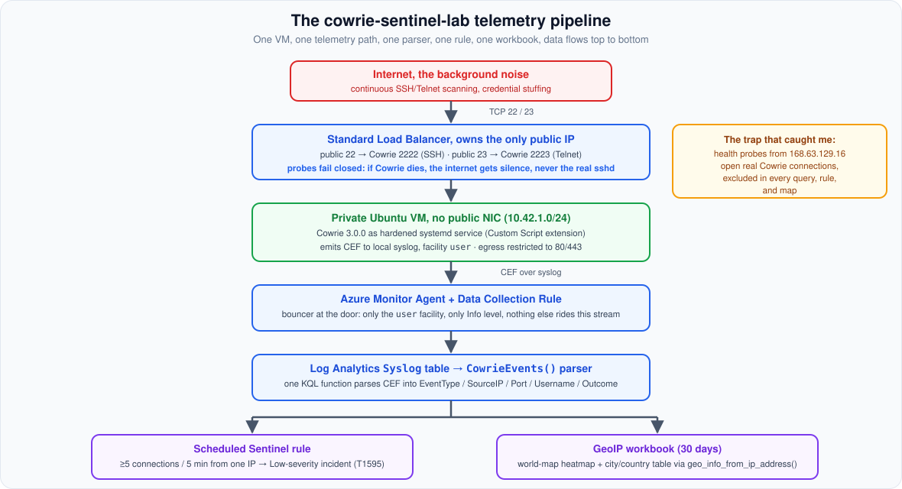
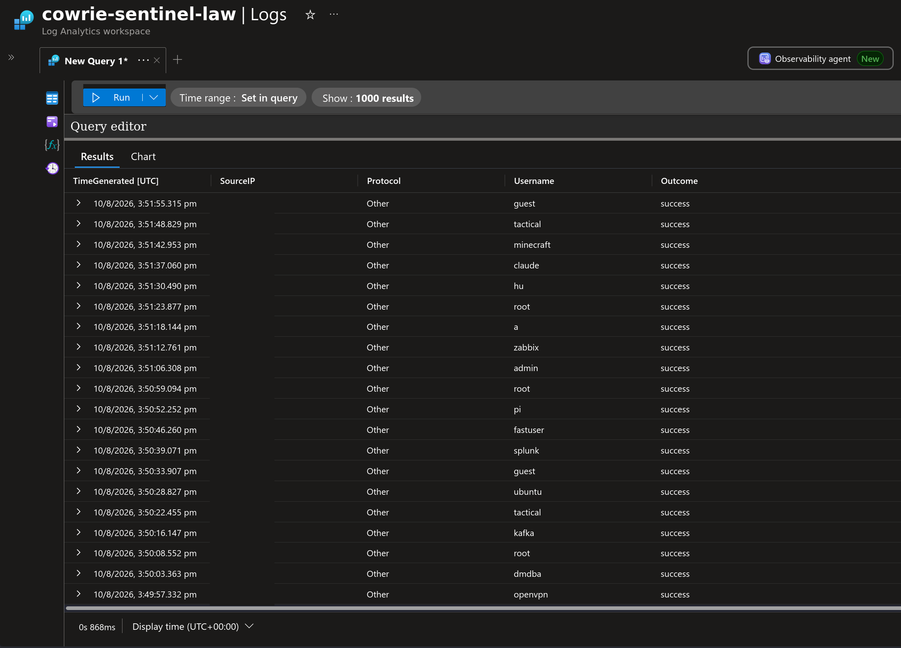
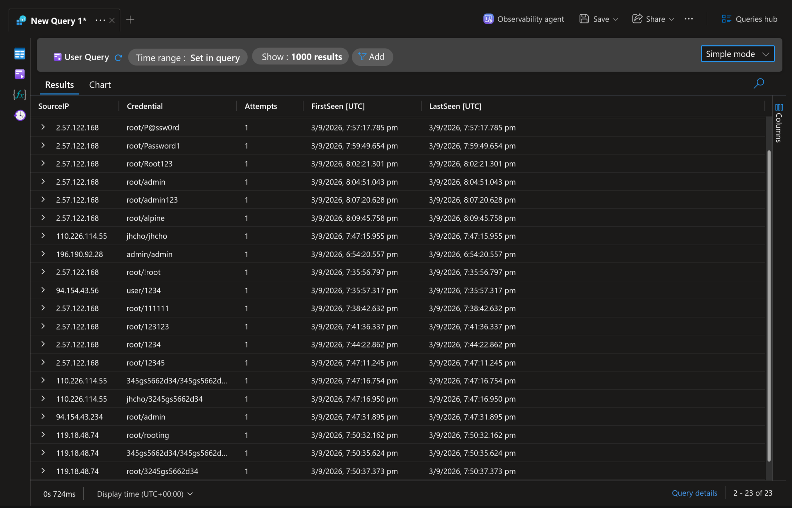
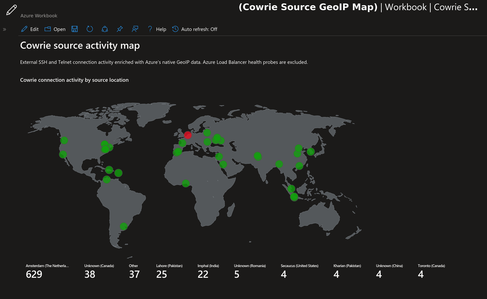
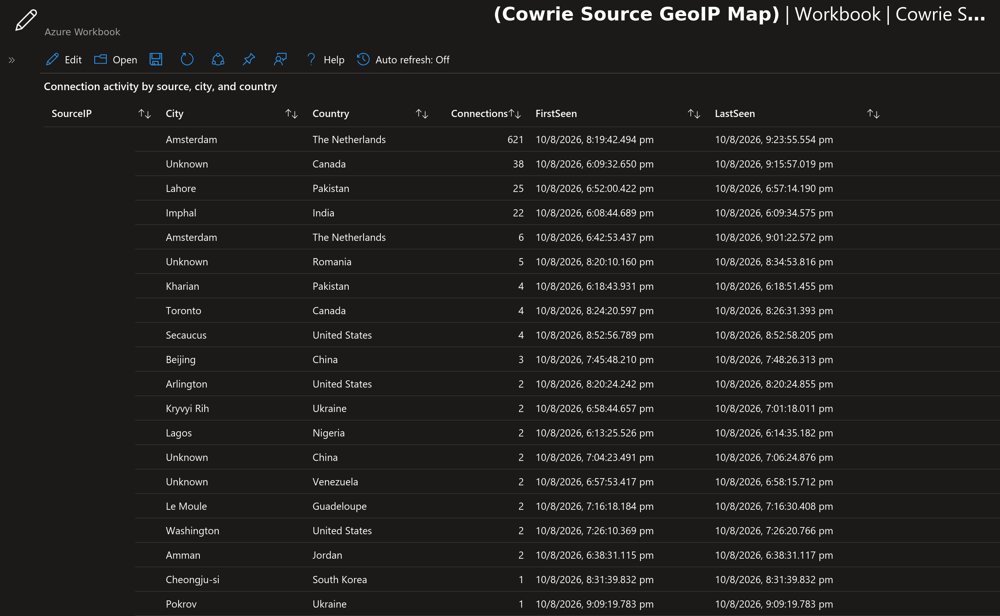

## A diary buried in the woods

Part 1 ended with a problem. Cowrie records everything, every connection, every credential, every keystroke in the fake shell, but it records it *locally*, on the honeypot VM itself. And that VM is deliberately the least trustworthy machine in the world: it exists to be attacked. Reading attack logs by SSH-ing into the compromised-by-design box while bots keep streaming in is not security operations. It's a diary buried in the woods.

Security operations means queries, alerts, and dashboards. This article is about the pipeline that finally got it right in [cowrie-sentinel-lab](https://github.com/edgseu/cowrie-sentinel-lab): how a TCP handshake from a botnet node in one hemisphere becomes a parsed event, an analytics-rule incident, and a heatmap dot in Microsoft Sentinel a few minutes later.

## Act 0: The sensor that phoned home, just not to me

cowrie-sentinel-lab was not my first attempt. My first lab, [sentinel-dshield-honeypot-lab](https://github.com/edgseu/sentinel-dshield-honeypot-lab), deployed the official DShield honeypot from Part 1 onto an Azure VM and wrapped it in my own Sentinel plumbing. The idea was sound. The results split cleanly in half: the half I inherited worked, and the half I built did not.

The inherited half was the DShield installer, and it earns its reputation. One script turned the VM into a deception surface: firewall logging on essentially every inbound connection, the host's real SSH moved to port 12222 behind a trusted-CIDR allowlist, Cowrie answering on the standard SSH and Telnet ports, an HTTP honeypot on 80 and 443 capturing full web requests, and a cron job submitting everything to dshield.org every thirty minutes with a registered API key. I signed up, pasted the key, and watched my sensor's reports appear in my DShield account. The community pipeline worked so well that when I shut the server down after a couple of days, ISC emailed me with the subject "Is your DShield Honeypot Down?" (Part 1 has the full story.)

The half I built was the path to Sentinel: a Python normalizer reshaping Cowrie JSON and DShield firewall logs into a custom schema, delivered by the Azure Monitor Agent through a Data Collection Rule into a custom Log Analytics table called `DShieldEvents_CL`. On paper it looked reasonable. In practice, the community got my logs and my own SIEM got nothing: `DShieldEvents_CL` stayed empty for the entire life of the sensor.

I can't offer a tidy root cause, and that's partly the lesson. The chain I built had many links, file format, watcher, schema, DCR stream, table, and every one of them was custom, which means every one of them failed silently. Custom pipelines fail quietly, and a honeypot VM is the last place you want to debug a file-watcher at midnight.

That failure wrote the design rules for the rest of this article:

- Use the platform's standard, boring ingestion path (the `Syslog` table) instead of a custom schema.
- Keep exactly one telemetry path, so there is exactly one thing to fix.
- Verify every hop with local tools (`journalctl`, the raw table) before building a single query on top.
- Keep secrets like API keys in Key Vault, pulled by the VM's managed identity, never in Terraform state.

Every rule below has a scar behind it.

## The architecture

One VM, one telemetry path, one parser, one analytic rule, one workbook. Every component has exactly one job, owned by exactly one Terraform file:

| File | Owns |
|---|---|
| `terraform/infrastructure.tf` | Resource group, VNet, NSG, private VM, Load Balancer |
| `terraform/bootstrap.sh.tftpl` | Cowrie installation, config, systemd unit, retention |
| `terraform/monitoring.tf` | Log Analytics, Sentinel onboarding, AMA, DCR, parser function |
| `queries/*.kql` | Parser, detection, map, and summary queries |
| `terraform/sentinel.tf` | Scheduled rule and workbook |

End to end:

```text
Internet
  |  TCP 22 / 23
  v
Standard public Load Balancer
  |  public 22 -> Cowrie 2222 (SSH)
  |  public 23 -> Cowrie 2223 (Telnet)
  v
Private Ubuntu VM running Cowrie
  |  CEF -> rsyslog -> Azure Monitor Agent -> Data Collection Rule
  v
Log Analytics Syslog table
  -> CowrieEvents() parser
  -> scheduled Sentinel rule  +  GeoIP workbook
```text



## Act I: The front door belongs to nobody

The first decision is about *who owns the public IP*. The naive honeypot deployment is a VM with a public IP and Cowrie on some other port. I rejected it for two reasons: any real administrative SSH on an internet-facing host is one misconfiguration away from joining the threat model, and if the honeypot service dies, that design fails *open*: port 22 keeps answering, just with the wrong daemon.

Instead, the VM has no public IP at all. It sits on a private subnet (10.42.1.0/24), and the only public IP in the resource group is attached to an Azure Standard Load Balancer that maps public TCP 22 and 23 to Cowrie's private listeners on 2222 and 2223:

```hcl
resource "azurerm_lb_rule" "ssh" {
  name                           = "cowrie-ssh"
  loadbalancer_id                = azurerm_lb.sensor.id
  protocol                       = "Tcp"
  frontend_port                  = 22
  backend_port                   = 2222
  frontend_ip_configuration_name = "public"
  backend_address_pool_ids       = [azurerm_lb_backend_address_pool.sensor.id]
  probe_id                       = azurerm_lb_probe.ssh.id
}
```text

The property that makes this shape right for a honeypot: health probes fail *closed*. A TCP probe checks Cowrie's own ports every five seconds, and two consecutive failures take the backend out of rotation. If Cowrie dies, the load balancer stops forwarding that port entirely. The decoy's failure mode is silence, never the VM's real sshd.

The Network Security Group completes the containment:

| Priority | Rule | Direction | Effect |
|---|---|---|---|
| 100 | `Allow-Cowrie-SSH` | Inbound | Internet → TCP 2222 |
| 110 | `Allow-Cowrie-Telnet` | Inbound | Internet → TCP 2223 |
| 120 | `Allow-Azure-Load-Balancer-Probes` | Inbound | `AzureLoadBalancer` → 2222/2223 |
| 100 | `Allow-Web-Outbound` | Outbound | Any → Internet TCP 80/443 |
| 4000 | `Deny-Other-Internet-Outbound` | Outbound | Default deny for everything else |

The single outbound allow exists because Part 1's malware-capture trick needs it: Cowrie's `wget` must make *genuine* downloads to collect payloads. Egress control matters more than it looks: it becomes both a protection and a tell in Part 3.

## Act II: The fake server confesses in CEF

Inside the VM, Cowrie runs as a hardened systemd service (Part 1 covered the unit's sandboxing flags), installed by a bootstrap script that Terraform injects through the Custom Script extension, so the whole lab comes up from `terraform apply` with zero manual steps.

For transport, the lab uses Cowrie's `output_localsyslog` plugin with `format = cef`, the ArcSight Common Event Format: single-line, pipe-delimited, with a fixed seven-field header and a key-value extension. An abridged real event looks like this:

```text
CEF:0|Cowrie|Cowrie|3.0.0|cowrie.session.connect|Cowrie session connect|0|src=203.0.113.10 spt=51337 dpt=2222 ...
```text

rsyslog writes it to `/var/log/syslog` on the `user` facility, and the Azure Monitor Agent (a VM extension) tails it. The Data Collection Rule is the bouncer at the door:

```hcl
data_sources {
  syslog {
    name           = "cowrie-events"
    facility_names = ["user"]
    log_levels     = ["Info"]
    streams        = ["Microsoft-Syslog"]
  }
}
```text

Only the `user` facility, only Info level. Nothing else on the box, cron noise, auth spam, kernel chatter, can ride this stream into Log Analytics. A honeypot's telemetry is only as trustworthy as its containment, and the cheapest containment is a collection filter that physically cannot carry anything else. The workspace pays per GB (`PerGB2018`) with a daily quota cap, because internet background noise is voluminous and this is a hobby budget.

## Act III: One parser to read them all

Raw syslog entries are strings. The lab's most reusable artifact is a Log Analytics saved function, deployed by Terraform, that every other query calls by name:

```text
Syslog
| where ProcessName == "cowrie" and SyslogMessage contains "CEF:0|Cowrie|Cowrie|"
| extend IngestionTime = ingestion_time()
| extend CefMessage = substring(SyslogMessage, indexof(SyslogMessage, "CEF:0|"))
| extend EventType = extract(@"^CEF:0\|Cowrie\|Cowrie\|[^|]+\|([^|]+)\|", 1, CefMessage)
| extend CefExtension = extract(@"^(?:[^|]*\|){7}(.*)$", 1, CefMessage)
| parse-kv CefExtension as (src: string, spt: long, dpt: long, duser: string, outcome: string)
    with (pair_delimiter=' ', kv_delimiter='=', escape='\\', greedy=true)
| project TimeGenerated, Computer, EventType,
    SourceIP = src, DestinationPort = toint(dpt),
    Username = duser, Outcome = outcome, SyslogMessage
```text

Three stages: filter to Cowrie's CEF lines, extract the event id (the fifth pipe-delimited header field) with a regex, then parse the key-value extension with `parse-kv` in `greedy=true` mode so values containing spaces survive. Saved with the alias `CowrieEvents()`, it gives every query in the workspace the same vocabulary: `EventType`, `SourceIP`, `DestinationPort`, `Username`, `Outcome`. The untouched `SyslogMessage` column stays in the projection, which is the debugging escape hatch: when a parsed result looks wrong, check the raw line before touching the parser.

This is the pattern worth stealing: don't let every query parse its own input. A parser function is to KQL what a model layer is to an app.

## Act IV: Deciding what counts as an attack

My first rule version was a brute-force detector on `cowrie.login.failed`, the obvious choice, and the wrong one. Part 1 established why: this honeypot accepts credentials freely, so *failures* are rare and *successes* mean nothing. Worse, a login-based rule is blind to the most common visitor of all: the scanner that connects, grabs the banner, and leaves without trying a password.

So detection is built on `cowrie.session.connect`, the event that fires for every external connection, credential or not:

```text
let rule_frequency = 5m;
let ingestion_delay = 5m;
CowrieEvents()
| where TimeGenerated >= ago(rule_frequency + ingestion_delay)
| where IngestionTime > ago(rule_frequency)
| where EventType == "cowrie.session.connect"
| where isnotempty(SourceIP) and SourceIP != "168.63.129.16"
| extend Protocol = case(DestinationPort == 2222, "SSH", DestinationPort == 2223, "Telnet", "Other")
| summarize
    ConnectionAttempts = count(),
    FirstSeen = min(TimeGenerated),
    LastSeen = max(TimeGenerated)
  by SourceIP, Protocol, DestinationPort, WindowStart = bin(TimeGenerated, 5m)
| where ConnectionAttempts >= 5
```text

Three judgment calls are embedded in that query:

**The magic exclusion.** Days after first deploying, the "attacker activity" view had a suspiciously persistent cluster: every five seconds, on the dot, from one address. It was `168.63.129.16`, Azure's shared platform IP, source of the load balancer's TCP health probes. Every probe opens a TCP connection to Cowrie, which is exactly what a probe should do, and Cowrie logs it exactly as what it looks like: an inbound connection. In a honeypot, even your infrastructure attacks you. The rule, the queries, and the workbook all exclude it.

**Ingestion delay.** An event can happen at 12:00 and become queryable at 12:04. A rule that only looks at event-time `TimeGenerated` silently misses events that hadn't landed yet. So the rule runs every five minutes (`query_frequency = PT5M`), looks back ten minutes of event time (`query_period = PT10M`), and then filters on `IngestionTime > ago(5m)` so each run consumes only freshly landed data without double-counting. This is Microsoft's documented ingestion-delay pattern.

**Honest severity.** Five connections in five minutes is reconnaissance, not compromise. The rule maps to MITRE ATT&CK `T1595` (Active Scanning) at severity Low, with the source IP mapped as the alert entity so incidents pivot straight to a location and session history. Grouping is disabled (one incident per triggered IP) and suppression matches the frequency. A honeypot alert that screams CRITICAL BREACH is a honeypot you'll learn to ignore.



*The secondary signal: real `cowrie.login.success` events from live traffic. Every "accepted" username, including a bot that tried `splunk` and another that tried `minecraft`, went into the fake shell, not a real account. This table is also what convinced me a login-based rule was the wrong design: look how uniform the outcomes are.*



*The credential view from the lab's first full day: 23 accepted pairs from six sources. The `2.57.122.168` walker stepped through a dictionary roughly every two minutes and succeeded on every attempt, including `root:!root`, a password the honeypot's own denial rule looks like it should reject but doesn't, because plain denial rules match the exact string, not substrings.*

## Act V: The world map

The workbook plots 30 days of connection sources using Azure's native GeoIP function:

```text
let SelectedEventType = "cowrie.session.connect";
CowrieEvents()
| where EventType == SelectedEventType
| where isnotempty(SourceIP) and SourceIP != "168.63.129.16"
| extend latitude = geo_info_from_ip_address(SourceIP)[0], longitude = geo_info_from_ip_address(SourceIP)[1]
| summarize EventCount=count() by latitude, longitude, country = geo_info_from_ip_address(SourceIP)[2]
```text

The workbook's `mapSettings` (deployed as JSON through `azurerm_application_insights_workbook`) render that as a heatmap: fixed-size markers, green-to-red color scale by event count, with a source-IP, city, and country table beneath, including honest `Unknown` rows where GeoIP has no city-level answer. A single variable, `SelectedEventType`, flips the whole view from connections to `cowrie.login.success` for the accepted-credentials presentation.



*Thirty days of live data. The red hotspot, 629 connections from Amsterdam, is exactly the hosted brute-force infrastructure this lab exists to watch.*



## What this lab deliberately doesn't do

One sensor, no high availability, local Terraform state, no CI/CD, no SOAR automation, no production claims. The VM is *designed* to be owned by strangers: no secrets, no real credentials, no valuable workloads anywhere in the resource group, and `make destroy` tears the whole thing down.

But at this size it demonstrates the full shape of real SOC telemetry: expose a surface deliberately, filter collection at the door, normalize with one parser, detect with honest thresholds, visualize for humans. It stands up from `make plan` in about the time it takes the first bot to find it.

## Next: the awkward question

Everything here assumes the visitors believe the decoy. The entire pipeline, alert, map, incident, depends on bots happily typing into a fake shell. In Part 3, we turn the telescope around: a published technique for unmasking cloud honeypots, protocol probes purpose-built for catching Cowrie, and a line-by-line autopsy of what my lab would and wouldn't give away, including one accidental property of its Azure plumbing that answers certain reality-checks with *real* infrastructure.

---

*The complete lab, Terraform, KQL queries, workbook, and user guide, is at [github.com/edgseu/cowrie-sentinel-lab](https://github.com/edgseu/cowrie-sentinel-lab). Missed the start? Read Part 1: "How Honeypots Work, from DShield to Cowrie."*
