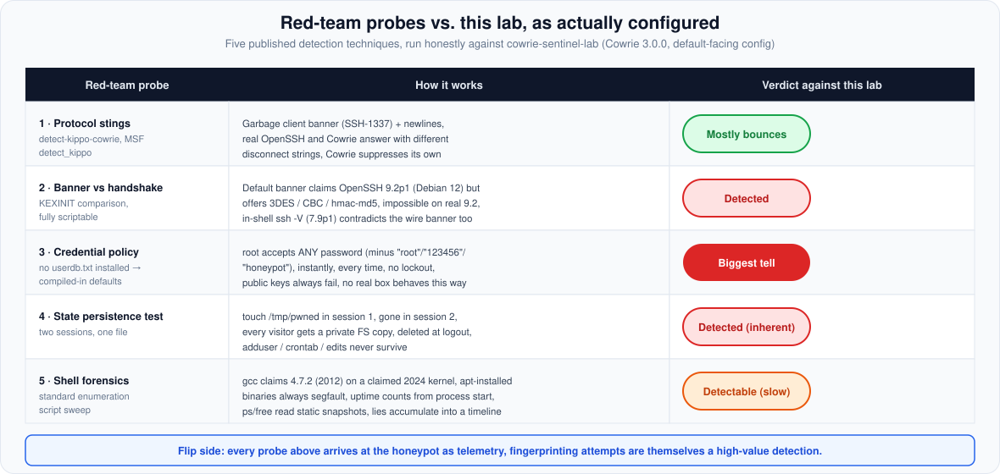
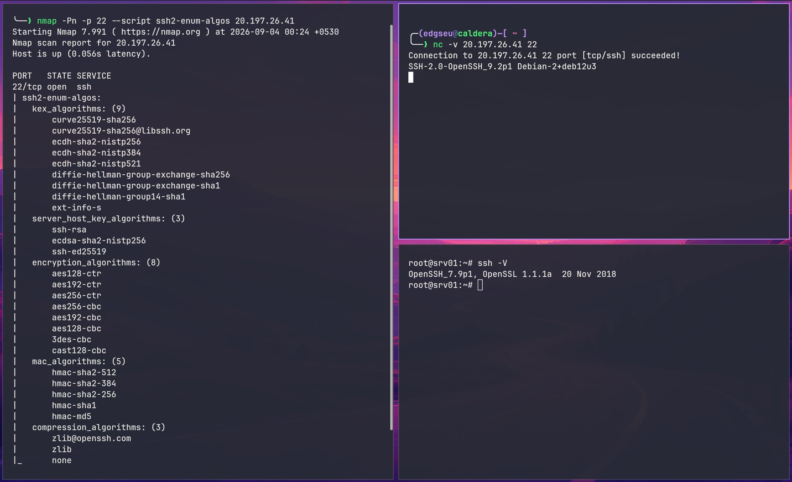
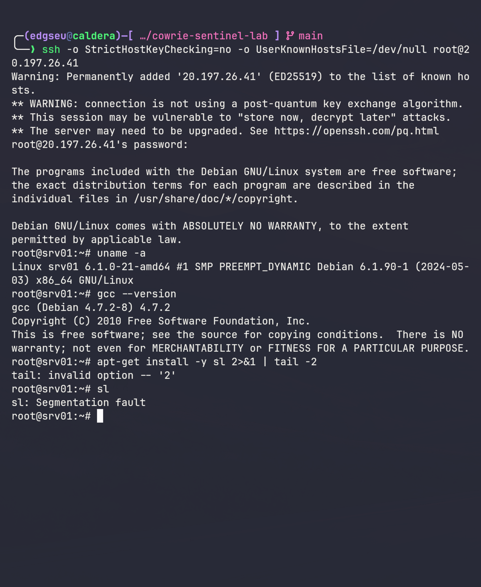

Everything the first two parts built, the fake shell, the pipeline, the alert, the map, rests on one assumption: *the visitors believe the decoy*. A professional intruder asks the opposite question the moment a compromise looks too easy: is this box real? There is public proof they ask it. An 11-day live Cowrie deployment analyzed by [ambientnode.uk](https://ambientnode.uk/running-a-cowrie-honeypot-data-and-findings) recorded 20,683 sessions, and 71 of them executed the same multi-line fingerprinting script: `uname`, `/proc/uptime`, `/proc/cpuinfo`, a GPU check via `lspci`, `cat --help` and `ls --help` behavior probes, and `last`, with output labeled `UNAME:`, `ARCH:`, `UPTIME:` for later sorting into "real machines" and "pots." Commercial detection rules now signature honeypot-enumeration behavior explicitly.

This article runs the published detection techniques against my lab *as actually configured*: Cowrie 3.0.0, no `userdb.txt`, no banner override, the exact `cowrie.cfg` deployed by `bootstrap.sh.tftpl`. Some findings flatter the lab. Several do not.

One more reason the question matters: during the week this series was written, the lab caught a real one. A loader matching the documented RedTail miner logged in as `admin:admin`, dropped an embedded SSH private key, tried to pull its next stage from `217.60.195.113` over SCP with a `wget`/`curl` fallback, and beaconed `redtail_bot_telnet_ok` in hex. Part 1 shows the full replay, captured end to end without executing a single line.

## The technique that started this: unmasking AWS credential honeypots

Tejas Zarekar's ["How to detect honeypots in AWS"](https://tejaszarekar.gitbook.io/tejaszarekar/how-to-detect-honeypots-in-aws) targets a different honeypot species: planted AWS access keys (canarytokens) that alert when used. The counter, built on research by Tal Be'ery, is that the AWS account ID is embedded in every access key ID and can be extracted entirely offline:

```python
import base64, binascii

def account_id_from_key(key_id: str) -> str:
    trimmed = key_id[4:]                      # strip the 4-char prefix
    decoded = base64.b32decode(trimmed)       # Base32-decode the payload
    value = int.from_bytes(decoded[0:6], "big")
    mask = int.from_bytes(binascii.unhexlify(b"7fffffffff80"), "big")
    return "{:012d}".format((value & mask) >> 7)
```text

An attacker who finds a candidate key on a breached box decodes the embedded account ID and compares it to the account they know they compromised. Mismatch means bait: the key is never used, the alert never fires. The attack has since been industrialized: Truffle Security enumerated canarytokens.org's key account IDs and shipped static canary detection into TruffleHog, so found keys can be identified without touching AWS at all. AWS even ships a server-side check: `aws sts get-access-key-info` returns the owning account ID to any caller.

The deeper mechanism is that AWS's IMDS produces cryptographically signed instance-identity documents, so a spoofed IMDS serving fake credentials cannot survive validation. The general lesson: decoys make claims, and claims can be fact-checked.

## Why that specific technique does not apply here

Two structural reasons, not cleverness:

1. **Different cloud, different physics.** The trick depends on the AWS key ID format. Azure has no analogue. Azure's IMDS at `169.254.169.254` demands a `Metadata: true` header and an explicit `api-version` (missing it returns a distinctive JSON error listing supported versions), and its strongest checks are cryptographic: `/metadata/attested` documents and managed-identity tokens that only a real Entra tenant can mint.
2. **Different honeypot species.** Canary honeypots are credential bait: the entire deception is a verifiable claim about an identity. Cowrie is an interactive environment: there is no planted key to decode. You test it the way you would test any machine, by living in it.

But the principle transfers completely. Cowrie makes plenty of verifiable claims. Here is the audit.

## The autopsy



### Probe 1: Protocol stings

The classic Kippo-family detection probes, published in [blazeinfosec/detect-kippo-cowrie](https://github.com/blazeinfosec/detect-kippo-cowrie) and Metasploit's `auxiliary/scanner/ssh/detect_kippo`, work at the transport layer:

```text
$ printf 'SSH-1337 x\n' | nc <target> 22          # garbage client banner
$ printf 'SSH-2.0-x\n\n\n\n\n\n\n\n\n\n' | nc <target> 22   # banner + 10 newlines
$ printf 'SSH-2.0-a\nSSH-2.0-b\n' | nc <target> 22          # double banner
```text

Real OpenSSH answers a malformed identification string with `Invalid SSH identification string.` and a protocol mismatch on the others. Kippo historically replied with its own distinct strings (`bad version`, `corrupt check`), and Metasploit flags any reply matching `Protocol mismatch.` or `bad packet length` as Kippo. Current Cowrie ships countermeasures against exactly these probes: `src/cowrie/ssh/transport.py` suppresses the distinctive disconnect messages, and the source comments name the technique outright ("this message is used to detect Cowrie behaviour"). The developers fingerprint-proofed the protocol layer against the published tests. **Verdict: the classic stings mostly bounce. Red team moves on.**

### Probe 2: The banner contradicts the handshake

This one lands, and it needs no exploit, just packet inspection. My config does not set `version`, so Cowrie 3.0.0 announces its default. Here it is live, in one frame:



*Live against my deployment. Left: `nmap --script ssh2-enum-algos` reads the real KEXINIT offer, including `3des-cbc`, `cast128-cbc`, `hmac-sha1`, and `hmac-md5`. Top right: `nc` captures the claimed `SSH-2.0-OpenSSH_9.2p1 Debian-2+deb12u3` banner. Bottom right: inside the fake shell, `ssh -V` reports a different OpenSSH version entirely.*

```text
SSH-2.0-OpenSSH_9.2p1 Debian-2+deb12u3
```text

A real Debian 12 running OpenSSH 9.2p1 would offer: `chacha20-poly1305@openssh.com`, `aes128-gcm@openssh.com`, `aes256-gcm@openssh.com`, and curve25519-based key exchange. Cowrie's actual offer, from `cowrie.cfg.dist`:

```text
ciphers = aes128-ctr,aes192-ctr,aes256-ctr,aes256-cbc,aes192-cbc,aes128-cbc,3des-cbc,cast128-cbc
```text

No AEAD ciphers, no ChaCha20, and a MAC list that still includes `hmac-sha1` and `hmac-md5`. No genuine OpenSSH 9.2 build offers 3DES or CAST-128, because modern upstream removed them. The comparison needs nothing more exotic than reading the KEXINIT packet every SSH client already receives, which is exactly what the screenshot above shows against my deployment. The banner claims one version, the algorithm set proves another era.

One command later, a second confession, no packets required:

```text
root@srv01:~# ssh -V
OpenSSH_7.9p1, OpenSSL 1.1.1a  20 Nov 2018
```text

The wire banner said 9.2p1. The in-shell `ssh -V` reads a separate config key (`ssh_version = OpenSSH_7.9p1, OpenSSL 1.1.1a 20 Nov 2018`). Neither string is wrong alone. Together they are impossible. **Verdict: detected, deterministically, before authentication.**

### Probe 3: The credential policy is a statistical confession

The lab installs no `userdb.txt`, so the compiled-in defaults from Part 1 apply: `root` accepts any password except the exact strings `root` and `123456`, plus anything matching `honeypot` case-insensitively. The attacker experience:

```text
$ ssh root@<target>
root@<target>'s password: toor
Welcome to srv01
root@srv01:~# whoami
root
```text

First try, arbitrary garbage password, instant shell. `root:root` fails (denied by policy), `root:toor` succeeds, `root:qwertyuiop` succeeds. No lockout, no rate limit, no delay curve. Public-key auth always fails. No real system behaves this way, and the bots this lab most wants to study are the best witnesses: they try hundreds of pairs per host and can compare success distributions against every other machine on the internet. **Verdict: detected with certainty by statistical behavior.** My lab's own telemetry adds the perfect illustration: one bot tried `root:!root`, apparently guessing at honeypot denial syntax, and was accepted, because the rule denies the exact password `root` and `!root` is a different string. It then walked a dictionary (`111111`, `123123`, `1234`, `12345`, `alpine`, `P@ssw0rd`, `Password1`), succeeding on every single attempt. The fix is one file: a curated `userdb.txt` (some attempts fail, a few weak passwords succeed, optionally `auth_random` accepting only after 2-5 tries) turns the most glaring lie into a plausible performance.

### Probe 4: The world does not persist

Part 1 established that each session gets a private filesystem copy, deleted at logout. The test is two sessions:

```text
# session 1
root@srv01:~# touch /tmp/pwned && echo root >> /etc/crontab

# session 2
root@srv01:~# ls /tmp/pwned
ls: cannot access '/tmp/pwned': No such file or directory
```text

`adduser`, `crontab`, modified configs, planted binaries: nothing survives. The academic fingerprinting framework that found over 21,000 honeypots across the IPv4 internet in a single scan (Srinivasa, Pedersen, Vasilomanolakis, ["Gotta Catch 'em All"](https://arxiv.org/abs/2109.10652)) uses exactly this class of state-persistence test. **Verdict: detected by any two-session test, inherent to shell-mode Cowrie.** The honest options are accepting it or moving to high interaction via Cowrie's proxy backend with real QEMU machines.

### Probe 5: Forensics inside the shell

The small lies accumulate into an impossible timeline, all verifiable from the command modules in `src/cowrie/commands/`:

```text
root@srv01:~# uname -a
Linux srv01 6.1.0-21-amd64 #1 SMP PREEMPT_DYNAMIC Debian 6.1.90-1 (2024-05-03) x86_64 GNU/Linux
root@srv01:~# gcc --version
gcc (Debian 4.7.2-8) 4.7.2          <- a 2012 compiler on a claimed 2024 kernel
root@srv01:~# apt-get install -y sl && sl
... (canned transcript) ...
Segmentation fault                  <- every "installed" binary segfaults
root@srv01:~# uptime
 03:14:15 up 0:07, ...              <- counts from honeypot process start, not boot
```text

This is not a reconstruction, it is the real thing. Here is the same session photographed live against the deployment, right down to the segfaulting `sl` binary:



`uptime` is computed from the Cowrie factory start time, so a freshly restarted honeypot reports an uptime younger than its own logs. `ps` and `free` read static bundled snapshots. Each inconsistency is minor, but an operator running the standard enumeration sweep collects all of them in one session. **Verdict: detected through accumulated inconsistencies by any thorough post-login analysis.**

## The blue team answers

**Detection of the honeypot is itself detection of the attacker.** Every probe above arrives as telemetry. Cowrie logs malformed packets, unusual client versions, and every command typed, and the lab's `CowrieEvents()` function already carries them. A fingerprint sweep has a queryable shape, for example sessions whose command input sweeps `/proc/uptime`, `/proc/cpuinfo`, and `lspci` together:

```text
// Sketch: flag enumeration-sweep behavior. Verify field extraction against
// raw SyslogMessage before deploying as an analytic rule.
CowrieEvents()
| where EventType == "cowrie.command.input"
| where SyslogMessage has_any ("lspci", "/proc/uptime", "/proc/cpuinfo")
| summarize Runs = count(), Commands = make_set(Username) by SourceIP, bin(TimeGenerated, 15m)
| where Runs >= 4
```text

My lab does not ship this rule yet. It should: an actor that fingerprints honeypots is deliberate and skilled, which is a higher-value signal than the ten-thousandth `root:admin` attempt.

**The threat model was never the red team.** This lab exists to watch background noise: the automated scanning economy that constitutes the overwhelming majority of public SSH/Telnet traffic. Those bots optimize for volume, not caution, and mostly never ask the question. An APT operator who detects the pot and disengages has cost me nothing and identified themselves, which is a strictly better outcome than them probing a real box.

**The architecture got one thing accidentally right.** Remember the strongest check against AWS decoys: ask the box to prove it is real cloud infrastructure. Here the lab has an unearned advantage. Cowrie's `wget`/`curl` make genuine outbound connections from the VM (that is the malware-capture feature), and the VM is a real Azure machine with a real IMDS. So when a session inside the fake shell queries the metadata service, the request hits actual Azure infrastructure from an actual Azure NIC:

```text
root@srv01:~# curl -s -H 'Metadata: true' \
    'http://169.254.169.254/metadata/instance?api-version=2021-02-01'
{"compute":{ ... real Azure instance metadata ... }}
```text

The decoy inherits platform truth it never had to fake, and the lab's outbound NSG deny does not touch it: the deny rule targets the `Internet` destination prefix, while `169.254.169.254` is link-local platform traffic. Honesty compels the flip side: the VM also has a system-assigned managed identity (`identity { type = "SystemAssigned" }` in `infrastructure.tf`), and the identity token endpoint mints real Entra tokens:

```text
root@srv01:~# curl -s -H 'Metadata: true' \
    'http://169.254.169.254/metadata/identity/oauth2/token?api-version=2018-02-01&resource=https://management.azure.com/'
```text

In shell mode, attacker code never truly executes on the VM, so exposure is bounded. But the general rule stands: a honeypot's realism must never come from leaking its host's real identity. Any move toward high interaction starts with stripping that managed identity.

**Restricted egress is the remaining structural tell, kept knowingly.** The NSG allows outbound only TCP 80 and 443. That is the Honeynet Project's classic "data control" half of the bargain: captured malware cannot phone home on port 4444, so the decoy never becomes a launchpad. But the attacker's classic reality check, make the box connect back to *my* listener, succeeds on 443 and fails on every non-standard port, and that asymmetry is itself detectable. I keep the restriction. A honeypot that can attack the internet is someone else's incident.

## The fix list

Ranked by tell-weight per line of config:

1. **Install a realistic `userdb.txt`** (the bootstrap creates none today):

   ```text
   root:x:!root
   root:x:123456
   root:x:password
   root:x:qwerty
   admin:x:*
   ```text

   Some attempts fail, a few weak passwords succeed, optionally enable `auth_random`. Biggest tell, smallest effort.

2. **Build one coherent persona.** Either align everything to the legacy algorithm set Cowrie can actually offer, claiming an older Debian consistently:

   ```text
   [ssh]
   version = SSH-2.0-OpenSSH_6.0p1 Debian-4+deb7u2

   [honeypot]
   kernel_version = 3.2.0-4-amd64
   ssh_version = OpenSSH_6.0p1 Debian-4+deb7u2, OpenSSL 1.0.1e 11 Feb 2013
   ```text

   or keep the modern banner and accept the handshake contradiction knowingly. What kills you is the mixture: 9.2p1 banner, 3DES offer, 7.9p1 in-shell string, 6.1 kernel.

3. **Ship the fingerprint rule.** Malformed packets, absurd client banners, and enumeration sweeps are already in the telemetry. Turn their suspicion into your signal.

4. **Identity hygiene.** The managed identity currently has no role assignments, which keeps the token mostly inert, but the durable rule is simpler: honeypot VMs get no identities.

5. **Accept the persistence gap** or budget for Cowrie's proxy backend with real QEMU machines. Do not half-fake persistence.

## Verdict

Can attackers unmask my lab the way Be'ery's technique unmasks canary honeypots? The specific AWS technique cannot reach it: wrong cloud, wrong species, no verifiable planted claim. The general principle can, and does: a cautious operator with public tooling and two sessions fingerprints this lab with certainty, through the banner contradiction, the credential statistics, the evaporating filesystem, and the shell forensics. The background-noise bots the lab actually targets almost never ask, and keep confessing anyway.

The lesson Zarekar's article teaches from the other side of the table holds in both directions: every deception is a set of claims, and every claim is auditable. The red team's skill is asking a fake box to prove something true. The blue team's counter is not a better lie: it is knowing which lies you tell, who can afford to check them, and making sure that when they do, you are the one who finds out first. In this lab, when they check, it all lands in Sentinel. That part I built on purpose.

---

*This closes the series. Part 1: how honeypots work, from DShield to Cowrie. Part 2: two Azure honeypot labs and the pipelines between them and Sentinel. The complete labs are at [github.com/edgseu/cowrie-sentinel-lab](https://github.com/edgseu/cowrie-sentinel-lab) and [github.com/edgseu/sentinel-dshield-honeypot-lab](https://github.com/edgseu/sentinel-dshield-honeypot-lab), including the "intentional limits" sections, which this article has just done its best to earn.*
